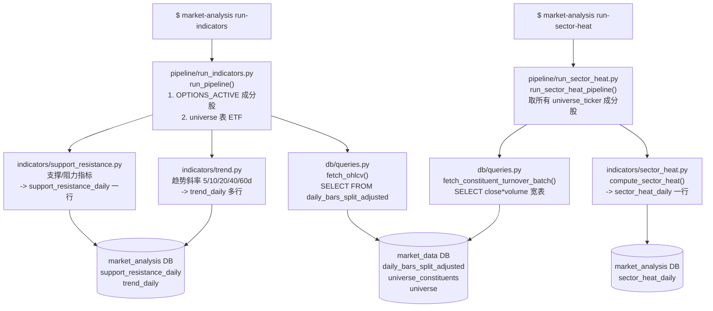
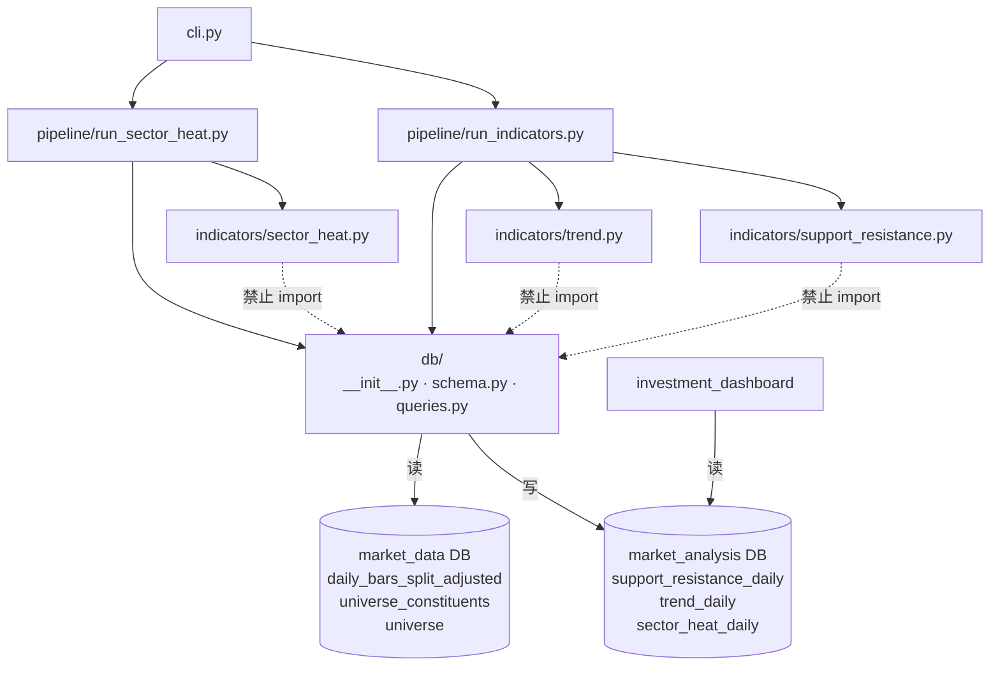

# Market Analysis — 行情指标分析系统

基于 Python 的行情指标分析系统。每日自动读取股票行情数据，计算支撑阻力位、趋势和板块资金热度指标，结果持久化存储；展示和进一步分析由同级 `investment_dashboard` 项目负责。

---

## Current Indicator Storage

Daily symbol-level analysis is now split by responsibility:

- `support_resistance_daily` stores SR snapshots.
- `trend_daily` stores one row per symbol/date/trend window.
- `trend_segmentation_daily` and `trend_segment_daily` store the separate adaptive
  segmentation experiment summary and segment details.
- `trend_pattern_daily` stores layered regime/bias/path/terminal-state descriptors and one
  derived long-window pattern per symbol/date/lookback.
- `trend_pattern_v4_daily` independently stores v4 effective-leg structure plus accepted
  close-path geometry and temporal metrics per symbol/date/lookback.
- `sector_heat_daily` remains unchanged and independent from symbol indicators.

Calculation modules now live under `src/market_analysis/indicators/`:

- `support_resistance.py` computes SR levels, SR status, ATR distance, and breakouts.
- `trend.py` computes linear-regression trend windows.
- `trend_pattern_v4_legs.py`, `trend_pattern_v4_structure.py`, and
  `trend_pattern_v4_metrics.py` separately compute v4 legs, structure, and path metrics.

Snapshot query helpers return a wide, downstream-compatible view by joining/pivoting
`support_resistance_daily` and `trend_daily` internally. Display and further analysis are
handled by the separate `investment_dashboard` project.

---

## 目录

- [项目定位](#项目定位)
- [技术架构](#技术架构)
- [数据库设计](#数据库设计)
- [功能模块](#功能模块)
  - [SR 分析（支撑阻力位）](#sr-分析支撑阻力位)
  - [板块资金热度](#板块资金热度)
- [执行流程](#执行流程)
- [快速开始](#快速开始)
- [参数调整](#参数调整)
- [新增指标](#新增指标)
- [模块依赖关系](#模块依赖关系)

---

## 项目定位

| 维度 | 说明 |
|------|------|
| 核心职责 | SR 指标分析 + 趋势指标 + 板块资金热度监控 |
| 不做的事 | 交易策略、买卖建议、策略回测、持仓管理、自动下单 |
| 数据来源 | 直连同一 PostgreSQL，读取 `market_data` 库的分复权日线数据 |
| SR 分析标的 | `universe_constituents(OPTIONS_ACTIVE)` 成分股 + `universe` 表中的 ETF |
| 板块热度来源 | `universe_constituents` 中所有 `universe_ticker` 的成分股 |

---

## 技术架构

```
market_analysis/
├── dashboard.py                      # 历史展示入口；当前仅保留弃用提示
├── config/
│   ├── settings.yaml                 # 指标参数默认值
│   └── user_prefs.yaml               # 用户参数覆盖（可选，自动生成）
├── scripts/                          # shell / cron 脚本
├── src/market_analysis/
│   ├── config.py                     # 配置入口（pydantic-settings）
│   ├── db/
│   │   ├── __init__.py               # 双连接池（market_analysis + market_data）
│   │   ├── schema.py                 # 建表（指标快照表 + sector_heat_daily，幂等）
│   │   └── queries.py                # 所有读写函数
│   ├── indicators/
│   │   ├── support_resistance.py     # 支撑阻力指标计算
│   │   ├── trend.py                  # 趋势指标计算
│   │   └── sector_heat.py            # 板块热度指标计算
│   ├── strategies/
│   │   └── archive/                  # 已归档的旧策略代码（不参与运行）
│   ├── pipeline/
│   │   ├── run_indicators.py         # 每日指标批量执行入口
│   │   └── run_sector_heat.py        # 板块热度批量执行入口
│   └── cli.py                        # Typer CLI
└── tests/
    ├── conftest.py
    ├── test_support_resistance.py
    └── test_sector_heat.py
```

### 技术选型

| 用途 | 选择 |
|------|------|
| 数据处理 | pandas |
| 数据库连接 | psycopg 3 + psycopg-pool |
| 配置管理 | pydantic-settings + YAML + .env |
| CLI | Typer |
| 日志 | structlog |
| 展示 | 由下游 `investment_dashboard` 项目负责 |
| 测试 | pytest |
| Lint | ruff |
| 指标计算 | scipy（摆动点检测）+ statsmodels |

---

## 数据库设计

### 双库架构

```
PostgreSQL (localhost:5432)
├── market_data        <- 只读
│   ├── daily_bars_split_adjusted   # OHLCV 分复权日线
│   ├── universe_constituents       # universe_ticker -> stock_ticker 映射
│   └── universe                    # ETF 列表（ticker, sub_category 等）
└── market_analysis    <- 读写
    ├── support_resistance_daily    # 支撑/阻力快照（每 symbol 每日一行）
    ├── trend_daily                 # 固定窗口趋势快照
    ├── trend_segmentation_daily    # 自适应分段模型选择摘要
    ├── trend_segment_daily         # 自适应趋势分段明细
    ├── trend_pattern_daily         # 长窗口趋势形态分类
    ├── trend_pattern_v4_daily      # v4 结构与 close-path 指标
    └── sector_heat_daily           # 板块热度快照（每 universe_ticker 每日一行）
```

### support_resistance_daily（支撑/阻力快照）

每个 symbol 每个交易日一行：

```sql
CREATE TABLE IF NOT EXISTS support_resistance_daily (
    symbol               TEXT  NOT NULL,
    date                 DATE  NOT NULL,
    nearest_support      FLOAT,          -- 最近支撑位中心价格
    nearest_resistance   FLOAT,          -- 最近阻力位中心价格
    dist_support_pct     FLOAT,          -- (close - zone_high) / close，负值=已入区
    dist_support_atr     FLOAT,          -- (close - zone_high) / ATR14
    dist_resistance_pct  FLOAT,          -- (zone_low - close) / close
    dist_resistance_atr  FLOAT,          -- (zone_low - close) / ATR14
    atr_14               FLOAT,          -- Wilder ATR（14日）
    sr_status            TEXT,           -- normal|watch|warning|at_support|at_resistance
    breakout_5d          TEXT,           -- break_up|break_down|NULL
    breakout_level       FLOAT,          -- 突破的 SR 中心价格
    PRIMARY KEY (symbol, date)
);
```

### trend_daily（趋势快照）

每个 symbol/date/window_label 一行：

```sql
CREATE TABLE IF NOT EXISTS trend_daily (
    symbol                       TEXT NOT NULL,
    date                         DATE NOT NULL,
    window_label                 TEXT NOT NULL,
    far_bars                     INT  NOT NULL,
    near_bars                    INT  NOT NULL DEFAULT 0,
    slope                        FLOAT,
    r2                           FLOAT,
    method                       TEXT NOT NULL DEFAULT 'linear_regression',
    observation_count            INT,
    log_slope_per_bar            FLOAT,
    linearity_r2                 FLOAT,
    fitted_log_return            FLOAT,
    actual_log_return            FLOAT,
    realized_volatility_daily    FLOAT,
    vol_adjusted_trend           FLOAT,
    efficiency_ratio             FLOAT,
    jackknife_slope_stability    FLOAT,
    adjacent_slope_stability     FLOAT,
    calculation_version          TEXT,
    PRIMARY KEY (symbol, date, window_label)
);
```

生产窗口为 `5d/10d/20d/40d/60d`。`slope/r2` 暂时保留旧口径供下游兼容；
固定趋势 v2 的基础值为 `log_slope_per_bar` 和 `linearity_r2`，并同时保存拟合/实际
log return、日度实现波动率、波动率调整趋势、路径效率和斜率稳定性。数据库使用小数
log 口径，不提前乘 100 或舍入；百分比展示由下游转换。

### 自适应趋势分段实验

阶段 B 使用 40/60 bar 长窗口，在 log price 上对所有合法断点组合执行全局连续分段
最小二乘。模型使用 linear-spline hinge basis，允许断点前后斜率变化，但要求拟合路径在
断点处连续；拟合线不强制经过实际端点。`adaptive_trend_v3` 在固定分段数的合法组合不超过
`exact_candidate_budget` 时执行分批精确穷举，超过预算时使用确定性 beam expansion、单断点
全域优化和相邻双断点局部优化，再使用 BIC 选择分段数。每一段不少于
`min_segment_bars`，因此拐点不需要落在固定窗口边界上。

分段仍使用 `[start, end)` 边界；后一段的路径指标包含 `start - 1 -> start` 的进入收益，
保证各段 `actual_log_return` 之和等于整个窗口的实际 log return。每段另存最大单日变化
`largest_move_log_return`、发生日期/bar 索引及其占该段绝对路径的比例，便于区分持续趋势
与单日大幅移动。

- `trend_segmentation_daily`：每个 `symbol/date/lookback_bars` 的模型选择摘要。
- `trend_segment_daily`：每个自适应段的日期边界和段内趋势指标。
- 方法：`continuous_piecewise_log_linear_deterministic_hybrid_bic`。
- 版本：`adaptive_trend_v3`。
- 40/60 bars 固定输出按推荐关系分别允许 4/5 段，精确搜索；交互窗口最多 250 bars、10 段。
- summary 显式保存 exact/approximate、全局最优保证、候选评估数、收敛状态和搜索审计信息。
- 独立实验命令不会修改 `trend_daily`，也不会由 `run-indicators` 自动触发。

### 长窗口趋势形态

`run-trend-pattern-analysis` 读取最新的自适应分段快照，并写入 `trend_pattern_daily`。
`trend_pattern_v3` 将结果拆成 `regime`、`directional_bias`、`path_structure` 和
`terminal_state` 四层，并派生 `pattern` 便捷标签。当前覆盖单边趋势、普通回撤、趋势恢复、
多次回撤、顶部/底部反转、反转后横盘、近似双顶/双底、收敛/扩张区间、复杂反转和
`irregular_path`；暂不实现头肩等需要更多极值约束的复杂形态。

`pattern_confidence` 是简单的描述性规则分数，不代表统计概率。每次运行会在日志中输出各
lookback 的 pattern/regime 分布、主导形态比例和 `irregular_path` 比例作为质检；这些质量
统计不写入数据库。本阶段不创建 `market_indicator_snapshot_v2`。

#### trend_pattern_v4：方向无关结构与路径指标

`trend_pattern_v4` 不替换生产中的 `trend_pattern_v3`，而是写入独立的
`trend_pattern_v4_daily`。算法过滤近似 flat 的 segment、合并连续同方向 segment 得到
effective legs，并对 1～4 条 effective legs 做如下处理：

第二阶段的指标定义、审核状态、未决问题和 session 交接信息统一维护在
[`docs/trend_pattern_v4_metric_spec.md`](docs/trend_pattern_v4_metric_spec.md)。该规格在指标进入
生产代码或数据库接口前作为设计事实来源。

1. 若首腿向下，将全部 signed fitted log return 乘以 `-1`，统一成从 up 开始的方向骨架。
2. 每增加一条腿，比较新 pivot `Pᵢ` 与前一个同类 pivot `Pᵢ₋₂`。这等价于比较当前腿与
   前一腿的绝对振幅 `Aᵢ/Aᵢ₋₁`。
3. 使用 `pivot_retest_tolerance` 将关系唯一分为 `short_of`、`retest`、`break`。
   默认容差为 `0.25`，对应振幅比区间 `< 0.75`、`[0.75, 1.333…]`、`> 1.333…`。

因此 n 条腿恰好有 `3ⁿ⁻¹` 个结构，1～4 条腿合计
`1 + 3 + 9 + 27 = 40` 个互斥且完备的方向无关结构单元。结构码使用
`L{腿数}-{关系缩写}`，其中 `S/R/B` 分别代表 `short_of/retest/break`，例如
`L3-RB`。当前阶段刻意不映射到 double test、reversal、range 等人类名称。

可运行下面的说明脚本查看单个输入的逐腿计算，并重新生成完整参考页面：

```bash
python scripts/show_trend_pattern_v4_stage1.py --legs "0.08,-0.10,0.12"
```

生成页面为 `artifacts/trend_pattern_v4_stage1.html`，包含全部 40 个结构的判定数值和示例图。

v4 的基础路径几何和时间组织指标由独立纯计算模块处理。`lookback_bars` 表示 close
observations 数量，因此 40/60 bars 分别包含 39/59 个 daily returns。运行：

```bash
market-analysis run-trend-pattern-v4-analysis
market-analysis run-trend-pattern-v4-analysis --date 2026-07-25
```

### sector_heat_daily（板块热度快照）

每个 universe_ticker 每个交易日一行：

```sql
CREATE TABLE IF NOT EXISTS sector_heat_daily (
    universe_ticker  TEXT  NOT NULL,
    date             DATE  NOT NULL,
    sector_turnover  FLOAT,     -- 板块当日成交额 = SUM(close x volume) 成分股汇总
    constituent_count INT,      -- 当日有数据的成分股数量
    turnover_ma20    FLOAT,     -- 成交额 20 日移动均值
    turnover_ratio   FLOAT,     -- 成交额 / MA20（热度倍数，>2 放量，>3 异常）
    turnover_zscore  FLOAT,     -- (today - 60d_mean) / 60d_std（跨板块可比）
    PRIMARY KEY (universe_ticker, date)
);
```

---

## 功能模块

### SR 分析（支撑阻力位）

**分析标的**（两个来源合并去重，个股在前）：
- `universe_constituents` 中 `universe_ticker = 'OPTIONS_ACTIVE'` 的成分股（~1000 只）
- `universe` 表中 `LENGTH(ticker) <= 4` 的 ETF（~60 只）

**算法流程**：

1. `scipy.argrelextrema` 检测历史 K 线的摆动高点（high 极大）和低点（low 极小）
2. 对摆动价格排序后单次扫描聚类：相邻价格差 <= `cluster_pct` 归为同一水平区
3. 过滤：触及次数 >= `min_touches` 且时间跨度 >= `min_span_days`
4. 极端单点处理：偏离最近 `extreme_order` 根 K 线均值超过 `extreme_pct` 的摆动点单独保留为极端位
5. 突破检测：回看 `breakout_window` 根 K 线，确认收盘是否穿越 SR 区边界
6. 趋势计算：对最近 5/10/20/40/60 日收盘价分别做线性回归，输出归一化斜率和 R²

**SR 状态（sr_status）**：

| 状态 | 条件 |
|------|------|
| `normal` | 距所有 SR 区 > 1.5×ATR |
| `watch` | 距最近 SR 区 <= 1.5×ATR |
| `warning` | 距最近 SR 区 <= 0.5×ATR |
| `at_support` | 价格在 SR 区内，从上方进入 |
| `at_resistance` | 价格在 SR 区内，从下方进入 |

**可调参数**（`config/user_prefs.yaml` 的 `sr` 节）：

| 参数 | 默认值 | 说明 |
|------|--------|------|
| `swing_order` | 13 | 摆动点灵敏度（左右各需 N 根 K 线） |
| `cluster_pct` | 2.0 | 聚类宽松度 % |
| `min_touches` | 2 | 最少触及次数 |
| `min_span_days` | 10 | 触及最短时间跨度 |
| `max_levels` | 10 | 最多输出条数 |
| `max_dist_pct` | 25.0 | 距当前价超过此 % 则过滤 |
| `extreme_order` | 30 | 极端单点检测窗口 |
| `extreme_pct` | 5.0 | 极端单点偏离阈值 % |
| `lookback_window` | 250 | 历史回溯 K 线根数 |
| `atr_period` | 14 | ATR 计算周期 |
| `watch_atr_mult` | 1.5 | 距离 <= N×ATR → watch |
| `warn_atr_mult` | 0.5 | 距离 <= N×ATR → warning |
| `breakout_window` | 5 | 突破检测回看窗口 |
| `trend_window` | 5 | 短期趋势窗口（固定计算 5/10/20/40/60 日） |

---

### 板块资金热度

**数据来源**：`universe_constituents` 中所有 `universe_ticker` 的成分股

**核心指标**：

| 指标 | 计算方式 | 含义 |
|------|----------|------|
| `sector_turnover` | SUM(close x volume) | 板块当日成交额 |
| `turnover_ma20` | 20 日滚动均值 | 成交额基准线 |
| `turnover_ratio` | today / MA20 | 热度倍数（>2 放量，>3 异常）|
| `turnover_zscore` | (today - 60d_mean) / 60d_std | 标准化热度（跨板块可比）|

**流水线逻辑**（`run_sector_heat.py`）：

1. 读取所有 `universe_ticker` 及其成分股列表
2. 批量拉取近 120 日成分股 OHLCV，计算 `close x volume` 宽表
3. 对每个 `universe_ticker` 调用 `compute_sector_heat()`，计算今日快照
4. 结果 upsert 到 `sector_heat_daily`

**详情页计算**（下游展示层动态计算，不依赖 DB）：

- 拉取展示范围前额外 90 天的历史数据作为暖启动
- 调用 `compute_sector_heat_history()` 计算完整滚动历史
- 确保从展示第一天起 MA20 和 60 日 z-score 均有效

---

## 执行流程

### 每日调度顺序

```
05:00  market-data update                   # 拉取行情，写入 market_data DB
05:30  market-analysis run-indicators       # 每日指标分析，写入指标快照表
05:35  market-analysis run-sector-heat      # 板块热度，写入 sector_heat_daily
```

### CLI -> Pipeline 调用链



---

## 快速开始

### 1. 环境准备

```bash
python -m venv .venv
.venv\Scripts\activate          # Windows
# source .venv/bin/activate     # macOS/Linux

pip install -i https://pypi.tuna.tsinghua.edu.cn/simple -e .
```

### 2. 配置数据库连接

```bash
cp .env.example .env
```

```env
DB_HOST=localhost
DB_PORT=5432
DB_NAME=market_analysis       # 写入库
DB_USER=market_data_user
DB_PASSWORD=your_password

SOURCE_DB_NAME=market_data    # OHLCV 读取库
```

### 3. 初始化数据库

```powershell
.\.venv\Scripts\Activate.ps1
market-analysis init-db
```

`init-db` 是幂等操作，每次部署或新增字段后均可重新执行（使用 `CREATE TABLE IF NOT EXISTS` + `ALTER TABLE ... ADD COLUMN IF NOT EXISTS`）。

### 4. 运行分析

```powershell
# 每日指标分析（OPTIONS_ACTIVE 成分股 + ETF -> 指标快照表）
market-analysis run-indicators

# 板块热度（所有 universe_ticker -> sector_heat_daily）
market-analysis run-sector-heat

# 自适应趋势分段实验（独立于固定窗口生产流程）
market-analysis run-trend-segmentation-experiment

# 单标的只读计算；输出 dashboard 可解析的 JSON，不写生产表
market-analysis compute-adaptive-trend `
  --symbol AAPL --lookback 250 --min-segment-bars 5 `
  --max-segments 10 --bic-penalty-multiplier 3.0

# 自动扫描参数并生成交互式验证报告（只读 market_data，不写指标表）
market-analysis validate-trend-segmentation --date 2026-07-17

# 指定样本；默认执行分阶段筛选，--full-grid 可运行完整笛卡尔积
market-analysis validate-trend-segmentation `
  --symbols SPY,QQQ,IWM,TLT,GLD,AAPL,NVDA,TSLA `
  --date 2026-07-17

# 基于最新自适应分段生成长窗口形态
market-analysis run-trend-pattern-analysis

# 基于持久化分段生成 v4 结构与路径指标
market-analysis run-trend-pattern-v4-analysis
```

验证参数网格、历史截面偏移和报告中展示的候选参数数量配置在
`validation.adaptive_trend`。默认流程先扫描 BIC 惩罚，再扫描最短分段长度，最后对候选
`max_segments` 组合执行多历史截面稳定性复验。结果写入
`artifacts/adaptive_trend_validation/<date>/run_<timestamp>/`：每次运行创建独立时间戳目录，
不会覆盖同一天的旧报告；目录中的 `index.html` 包含交互式价格/拟合/残差图，
并同时输出 `summary.csv`、`segments.csv` 和 `parameter_comparison.csv`。拟合质量与复杂度分数用于排序
复核优先级，不会自动修改生产 `adaptive_trend` 参数。

命令行按参数组显示 `bic_scan`、`minimum_scan`、`stability_review` 或 `full_grid` 进度条。
`anchor_offsets` 定义多个历史基准截面，每个基准只与
`base + anchor_comparison_step_bars` 组成局部比较对；默认 step 为 2 bars，不再直接比较
相差 10 bars 的相邻基准截面。`breakpoint_tolerance_bars` 是稳定性诊断使用的主断点匹配容差，
`breakpoint_tolerance_sensitivity_bars` 只生成容差敏感度列，不进入模型 `parameter_key`。
`local_breakpoint_set_stability` 仅比较每对窗口共同合法断点区域中的集合，并从共同区域
两端排除当前 `min_segment_bars`；两个截面都没有可比较断点时不会自动获得满分。报告使用
`fit_complexity_score` 通过统一公式综合 RSS 改善、段内线性度、最大分段数命中、接近最短长度
分段和单日变化主导风险。分阶段初筛和最终历史复验都按该分数排名；局部断点集合稳定性及其
证据数量继续独立展示，但不作为排名资格、评分项或排序条件。
HTML 的 Parameter comparison 标题下提供可折叠字段说明，逐项解释用途、计算公式和解读
限制。

### 5. 查看 SR 快照

```powershell
market-analysis show
market-analysis show --date 2026-06-14
```

### 6. 展示与分析

本项目不再维护 Streamlit 展示入口。指标快照、K 线详情、板块热度展示和数据库浏览统一由同级 `investment_dashboard` 项目读取本项目输出表后提供。

本项目保留 `dashboard.py` 作为弃用提示，误运行时会提示使用 `investment_dashboard`。

---

## 参数调整

编辑 `config/user_prefs.yaml`（覆盖 `settings.yaml` 默认值）：

```yaml
sr:
  swing_order: 13
  cluster_pct: 2.0
  min_touches: 2
  min_span_days: 10
  max_levels: 10
  max_dist_pct: 25.0
  extreme_order: 30
  extreme_pct: 5.0
  lookback_window: 250
  atr_period: 14
  watch_atr_mult: 1.5
  warn_atr_mult: 0.5
  breakout_window: 5
  trend_window: 5
```

修改参数后运行 `market-analysis run-indicators` 或 `market-analysis run-sector-heat` 重新写入快照表。

---

## 新增指标

1. 在 `src/market_analysis/indicators/` 新建文件，实现纯计算函数：

```python
def my_indicator(
    symbol: str,
    df: pd.DataFrame,   # DatetimeIndex，列为 open/high/low/close/volume
    params: dict,
) -> dict[str, Any] | None:
    # 返回可写入指标快照表的一行数据；无法计算时返回 None
    ...
```

2. 在 `pipeline/` 中读取源数据、调用指标函数，并通过 `db/queries.py` 写入对应快照表。
3. 在 `schema.py` 增加幂等建表/补字段 SQL，在 `queries.py` 增加读写函数。
4. 在 `settings.yaml` 添加参数块，补写单元测试，运行：

```bash
pytest tests/
```

---

## 模块依赖关系


