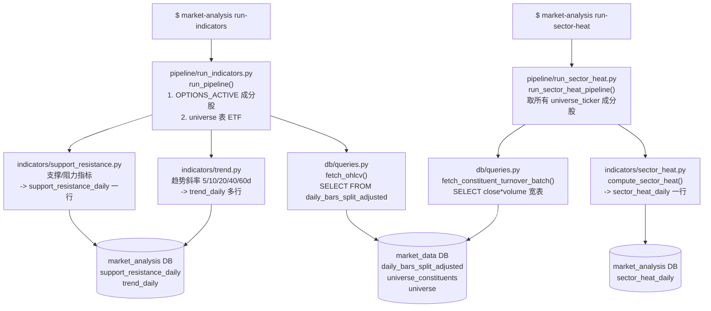
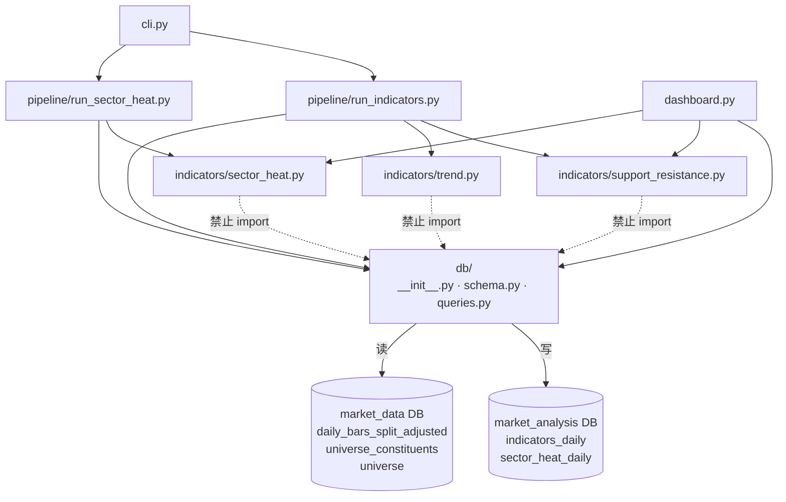

# Market Analysis — 行情指标分析系统

基于 Python 的行情指标分析系统。每日自动读取股票行情数据，计算支撑阻力位、趋势和板块资金热度指标，结果持久化存储并通过 Streamlit Dashboard 可视化展示。

---

## Current Indicator Storage

Daily symbol-level analysis is now split by responsibility:

- `support_resistance_daily` stores SR snapshots.
- `trend_daily` stores one row per symbol/date/trend window.
- `indicators_daily` is retained as a legacy compatibility table.
- `sector_heat_daily` remains unchanged and independent from symbol indicators.

Calculation modules now live under `src/market_analysis/indicators/`:

- `support_resistance.py` computes SR levels, SR status, ATR distance, and breakouts.
- `trend.py` computes linear-regression trend windows.

Dashboard query helpers still return a wide, dashboard-compatible snapshot by joining/pivoting
the new tables internally.

---

## 目录

- [项目定位](#项目定位)
- [技术架构](#技术架构)
- [数据库设计](#数据库设计)
- [功能模块](#功能模块)
  - [SR 分析（支撑阻力位）](#sr-分析支撑阻力位)
  - [板块资金热度](#板块资金热度)
- [执行流程](#执行流程)
- [快速开始](#快速开始)
- [参数调整](#参数调整)
- [新增指标](#新增指标)
- [模块依赖关系](#模块依赖关系)

---

## 项目定位

| 维度 | 说明 |
|------|------|
| 核心职责 | SR 指标分析 + 趋势指标 + 板块资金热度监控 |
| 不做的事 | 交易策略、买卖建议、策略回测、持仓管理、自动下单 |
| 数据来源 | 直连同一 PostgreSQL，读取 `market_data` 库的分复权日线数据 |
| SR 分析标的 | `universe_constituents(OPTIONS_ACTIVE)` 成分股 + `universe` 表中的 ETF |
| 板块热度来源 | `universe_constituents` 中所有 `universe_ticker` 的成分股 |

---

## 技术架构

```
market_analysis/
├── dashboard.py                      # Streamlit 可视化入口
├── config/
│   ├── settings.yaml                 # 指标参数默认值
│   └── user_prefs.yaml               # 用户参数覆盖（可选，自动生成）
├── scripts/                          # shell / cron 脚本
├── src/market_analysis/
│   ├── config.py                     # 配置入口（pydantic-settings）
│   ├── db/
│   │   ├── __init__.py               # 双连接池（market_analysis + market_data）
│   │   ├── schema.py                 # 建表（indicators_daily + sector_heat_daily，幂等）
│   │   └── queries.py                # 所有读写函数
│   ├── indicators/
│   │   ├── support_resistance.py     # 支撑阻力指标计算
│   │   ├── trend.py                  # 趋势指标计算
│   │   └── sector_heat.py            # 板块热度指标计算
│   ├── strategies/
│   │   └── archive/                  # 已归档的旧策略代码（不参与运行）
│   ├── pipeline/
│   │   ├── run_indicators.py         # 每日指标批量执行入口
│   │   └── run_sector_heat.py        # 板块热度批量执行入口
│   └── cli.py                        # Typer CLI
└── tests/
    ├── conftest.py
    ├── test_support_resistance.py
    └── test_sector_heat.py
```

### 技术选型

| 用途 | 选择 |
|------|------|
| 数据处理 | pandas |
| 数据库连接 | psycopg 3 + psycopg-pool |
| 配置管理 | pydantic-settings + YAML + .env |
| CLI | Typer |
| 日志 | structlog |
| Dashboard | Streamlit + Plotly |
| 测试 | pytest |
| Lint | ruff |
| 指标计算 | scipy（摆动点检测）+ statsmodels |

---

## 数据库设计

### 双库架构

```
PostgreSQL (localhost:5432)
├── market_data        <- 只读
│   ├── daily_bars_split_adjusted   # OHLCV 分复权日线
│   ├── universe_constituents       # universe_ticker -> stock_ticker 映射
│   └── universe                    # ETF 列表（ticker, sub_category 等）
└── market_analysis    <- 读写
    ├── indicators_daily            # SR 快照（每 symbol 每日一行）
    └── sector_heat_daily           # 板块热度快照（每 universe_ticker 每日一行）
```

### indicators_daily（SR 快照宽表）

每个 symbol 每个交易日一行：

```sql
CREATE TABLE IF NOT EXISTS indicators_daily (
    symbol               TEXT  NOT NULL,
    date                 DATE  NOT NULL,
    nearest_support      FLOAT,          -- 最近支撑位中心价格
    nearest_resistance   FLOAT,          -- 最近阻力位中心价格
    dist_support_pct     FLOAT,          -- (close - zone_high) / close，负值=已入区
    dist_support_atr     FLOAT,          -- (close - zone_high) / ATR14
    dist_resistance_pct  FLOAT,          -- (zone_low - close) / close
    dist_resistance_atr  FLOAT,          -- (zone_low - close) / ATR14
    atr_14               FLOAT,          -- Wilder ATR（14日）
    sr_status            TEXT,           -- normal|watch|warning|at_support|at_resistance
    breakout_5d          TEXT,           -- break_up|break_down|NULL
    breakout_level       FLOAT,          -- 突破的 SR 中心价格
    trend_slope_5d       FLOAT,          -- 归一化线性回归斜率（5日）
    trend_r2_5d          FLOAT,          -- 线性回归 R²（5日）
    trend_slope_10d      FLOAT,          -- 归一化线性回归斜率（10日）
    trend_r2_10d         FLOAT,          -- 线性回归 R²（10日）
    trend_slope_20d      FLOAT,          -- 归一化线性回归斜率（20日）
    trend_r2_20d         FLOAT,          -- 线性回归 R²（20日）
    trend_slope_40d      FLOAT,          -- 归一化线性回归斜率（40日）
    trend_r2_40d         FLOAT,          -- 线性回归 R²（40日）
    trend_slope_60d      FLOAT,          -- 归一化线性回归斜率（60日）
    trend_r2_60d         FLOAT,          -- 线性回归 R²（60日）
    PRIMARY KEY (symbol, date)
);
```

趋势斜率（`trend_slope_Nd`）= 线性回归原始斜率 / 窗口首日收盘价，近似每 bar 的涨跌幅速率，不同价位的标的可直接比较。

### sector_heat_daily（板块热度快照）

每个 universe_ticker 每个交易日一行：

```sql
CREATE TABLE IF NOT EXISTS sector_heat_daily (
    universe_ticker  TEXT  NOT NULL,
    date             DATE  NOT NULL,
    sector_turnover  FLOAT,     -- 板块当日成交额 = SUM(close x volume) 成分股汇总
    constituent_count INT,      -- 当日有数据的成分股数量
    turnover_ma20    FLOAT,     -- 成交额 20 日移动均值
    turnover_ratio   FLOAT,     -- 成交额 / MA20（热度倍数，>2 放量，>3 异常）
    turnover_zscore  FLOAT,     -- (today - 60d_mean) / 60d_std（跨板块可比）
    PRIMARY KEY (universe_ticker, date)
);
```

---

## 功能模块

### SR 分析（支撑阻力位）

**分析标的**（两个来源合并去重，个股在前）：
- `universe_constituents` 中 `universe_ticker = 'OPTIONS_ACTIVE'` 的成分股（~1000 只）
- `universe` 表中 `LENGTH(ticker) <= 4` 的 ETF（~60 只）

**算法流程**：

1. `scipy.argrelextrema` 检测历史 K 线的摆动高点（high 极大）和低点（low 极小）
2. 对摆动价格排序后单次扫描聚类：相邻价格差 <= `cluster_pct` 归为同一水平区
3. 过滤：触及次数 >= `min_touches` 且时间跨度 >= `min_span_days`
4. 极端单点处理：偏离最近 `extreme_order` 根 K 线均值超过 `extreme_pct` 的摆动点单独保留为极端位
5. 突破检测：回看 `breakout_window` 根 K 线，确认收盘是否穿越 SR 区边界
6. 趋势计算：对最近 5/10/20/40/60 日收盘价分别做线性回归，输出归一化斜率和 R²

**SR 状态（sr_status）**：

| 状态 | 条件 |
|------|------|
| `normal` | 距所有 SR 区 > 1.5×ATR |
| `watch` | 距最近 SR 区 <= 1.5×ATR |
| `warning` | 距最近 SR 区 <= 0.5×ATR |
| `at_support` | 价格在 SR 区内，从上方进入 |
| `at_resistance` | 价格在 SR 区内，从下方进入 |

**可调参数**（`config/user_prefs.yaml` 的 `sr` 节）：

| 参数 | 默认值 | 说明 |
|------|--------|------|
| `swing_order` | 13 | 摆动点灵敏度（左右各需 N 根 K 线） |
| `cluster_pct` | 2.0 | 聚类宽松度 % |
| `min_touches` | 2 | 最少触及次数 |
| `min_span_days` | 10 | 触及最短时间跨度 |
| `max_levels` | 10 | 最多输出条数 |
| `max_dist_pct` | 25.0 | 距当前价超过此 % 则过滤 |
| `extreme_order` | 30 | 极端单点检测窗口 |
| `extreme_pct` | 5.0 | 极端单点偏离阈值 % |
| `lookback_window` | 250 | 历史回溯 K 线根数 |
| `atr_period` | 14 | ATR 计算周期 |
| `watch_atr_mult` | 1.5 | 距离 <= N×ATR → watch |
| `warn_atr_mult` | 0.5 | 距离 <= N×ATR → warning |
| `breakout_window` | 5 | 突破检测回看窗口 |
| `trend_window` | 5 | 短期趋势窗口（固定计算 5/10/20/40/60 日） |

---

### 板块资金热度

**数据来源**：`universe_constituents` 中所有 `universe_ticker` 的成分股

**核心指标**：

| 指标 | 计算方式 | 含义 |
|------|----------|------|
| `sector_turnover` | SUM(close x volume) | 板块当日成交额 |
| `turnover_ma20` | 20 日滚动均值 | 成交额基准线 |
| `turnover_ratio` | today / MA20 | 热度倍数（>2 放量，>3 异常）|
| `turnover_zscore` | (today - 60d_mean) / 60d_std | 标准化热度（跨板块可比）|

**流水线逻辑**（`run_sector_heat.py`）：

1. 读取所有 `universe_ticker` 及其成分股列表
2. 批量拉取近 120 日成分股 OHLCV，计算 `close x volume` 宽表
3. 对每个 `universe_ticker` 调用 `compute_sector_heat()`，计算今日快照
4. 结果 upsert 到 `sector_heat_daily`

**详情页计算**（Dashboard 动态计算，不依赖 DB）：

- 拉取展示范围前额外 90 天的历史数据作为暖启动
- 调用 `compute_sector_heat_history()` 计算完整滚动历史
- 确保从展示第一天起 MA20 和 60 日 z-score 均有效

---

## 执行流程

### 每日调度顺序

```
05:00  market-data update                   # 拉取行情，写入 market_data DB
05:30  market-analysis run-indicators       # 每日指标分析，写入指标快照表
05:35  market-analysis run-sector-heat      # 板块热度，写入 sector_heat_daily
```

### CLI -> Pipeline 调用链



---

## 快速开始

### 1. 环境准备

```bash
python -m venv .venv
.venv\Scripts\activate          # Windows
# source .venv/bin/activate     # macOS/Linux

pip install -i https://pypi.tuna.tsinghua.edu.cn/simple -e .
```

### 2. 配置数据库连接

```bash
cp .env.example .env
```

```env
DB_HOST=localhost
DB_PORT=5432
DB_NAME=market_analysis       # 写入库
DB_USER=market_data_user
DB_PASSWORD=your_password

SOURCE_DB_NAME=market_data    # OHLCV 读取库
```

### 3. 初始化数据库

```powershell
.\.venv\Scripts\Activate.ps1
market-analysis init-db
```

`init-db` 是幂等操作，每次部署或新增字段后均可重新执行（使用 `CREATE TABLE IF NOT EXISTS` + `ALTER TABLE ... ADD COLUMN IF NOT EXISTS`）。

### 4. 运行分析

```powershell
# 每日指标分析（OPTIONS_ACTIVE 成分股 + ETF -> 指标快照表）
market-analysis run-indicators

# 板块热度（所有 universe_ticker -> sector_heat_daily）
market-analysis run-sector-heat
```

### 5. 查看 SR 快照

```powershell
market-analysis show
market-analysis show --date 2026-06-14
```

### 6. 启动 Dashboard

**推荐（后台运行）：**

```powershell
.\scripts\start_dashboard.ps1   # 启动
.\scripts\stop_dashboard.ps1    # 停止
```

> 首次运行若提示执行策略限制：`Set-ExecutionPolicy -Scope CurrentUser RemoteSigned`

**直接前台运行：**

```powershell
streamlit run dashboard.py --server.port 8504
```

访问：`http://localhost:8504`

---

## Dashboard 功能说明

### SR 概览页（默认页）

- 顶部指标卡：扫描股票数、在 SR 位数量、警告数量、近 5 日突破数
- 快照宽表按 ETF / 个股分组展示（数据来自 DB，非 yaml 配置），支持日期选择
  - ETF 表格附带 `sub_category` 分类字段
  - 趋势斜率列：5d / 10d / 20d / 40d / 60d 及对应 R²
- 数据新鲜度提示：若当前日期数据不完整，显示其余日期的 ETF / 个股分布
- 点击任意行在新标签页打开该 symbol 的详情页
- 侧边栏 `▶ 运行指标分析` 按钮触发 `market-analysis run-indicators` 重新计算

### SR 详情页（`?symbol=XXX`）

- Plotly 交互式 K 线图
- 支撑阻力区可视化：彩色阴影区 + 中心价格虚线 + 摆动点标记
- 多指标子图（共享 x 轴，同步十字线）：SR 距离、ATR、趋势斜率等
- 最新 SR 快照指标卡（支撑/阻力价、ATR、突破、5/10/20/40/60d 斜率）
- 历史指标走势表（90 日）
- 侧边栏可实时调整 SR 参数并保存到 `user_prefs.yaml`

### 板块热度概览页

- 所有 universe_ticker 的热度快照表（读取 `sector_heat_daily`）
- 热度倍数和 z-score 用颜色标注冷热
- 点击板块在新标签页打开热度详情页
- 侧边栏可触发 `market-analysis run-sector-heat`

### 板块热度详情页（`?sector=XXX`）

- K 线图（如有 ETF 行情数据）
- 成交额 + MA20 柱状图
- 热度倍数（ratio）折线图 + 1x/2x/3x 参考线
- Z-score 折线图 + ±2σ 参考线
- 所有子图共享 x 轴，鼠标悬浮显示同步十字线
- 每个子图可通过侧边栏开关单独关闭

### 数据库查看器

- 在 `market_analysis` / `market_data` 两库间切换
- 自动发现所有表，显示行数和字段列表
- 分页浏览表数据

---

## 参数调整

编辑 `config/user_prefs.yaml`（覆盖 `settings.yaml` 默认值）：

```yaml
sr:
  swing_order: 13
  cluster_pct: 2.0
  min_touches: 2
  min_span_days: 10
  max_levels: 10
  max_dist_pct: 25.0
  extreme_order: 30
  extreme_pct: 5.0
  lookback_window: 250
  atr_period: 14
  watch_atr_mult: 1.5
  warn_atr_mult: 0.5
  breakout_window: 5
  trend_window: 5
```

Dashboard 侧边栏修改参数后点击"保存"会写入 `user_prefs.yaml`，再点击"运行指标分析"重跑写库。

---

## 新增指标

1. 在 `src/market_analysis/indicators/` 新建文件，实现纯计算函数：

```python
def my_indicator(
    symbol: str,
    df: pd.DataFrame,   # DatetimeIndex，列为 open/high/low/close/volume
    params: dict,
) -> dict[str, Any] | None:
    # 返回可写入指标快照表的一行数据；无法计算时返回 None
    ...
```

2. 在 `pipeline/` 中读取源数据、调用指标函数，并通过 `db/queries.py` 写入对应快照表。
3. 在 `schema.py` 增加幂等建表/补字段 SQL，在 `queries.py` 增加读写函数。
4. 在 `settings.yaml` 添加参数块，补写单元测试，运行：

```bash
pytest tests/
```

---

## 模块依赖关系


