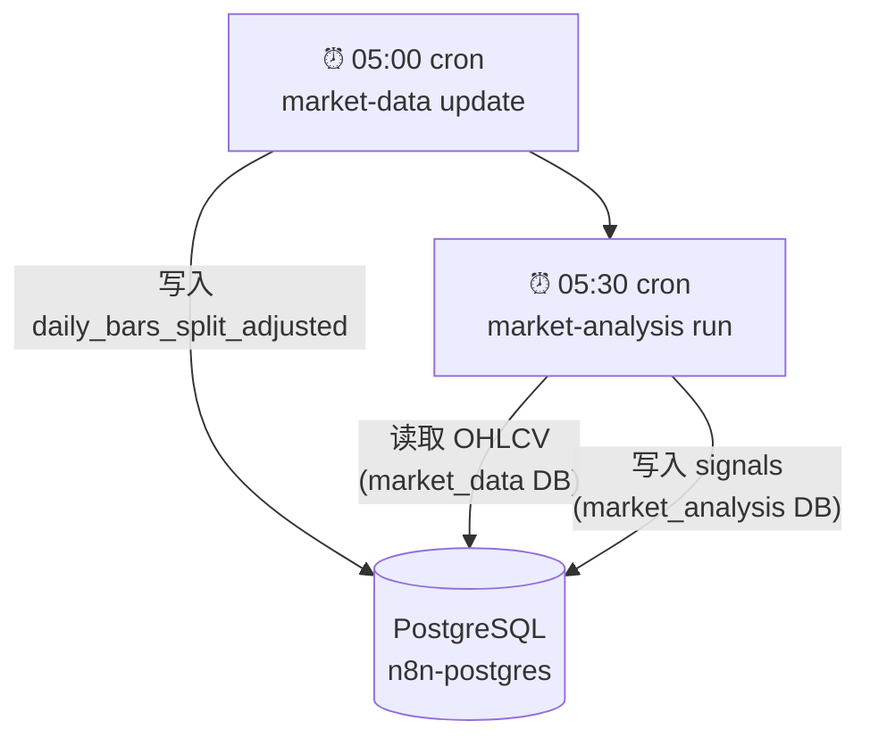
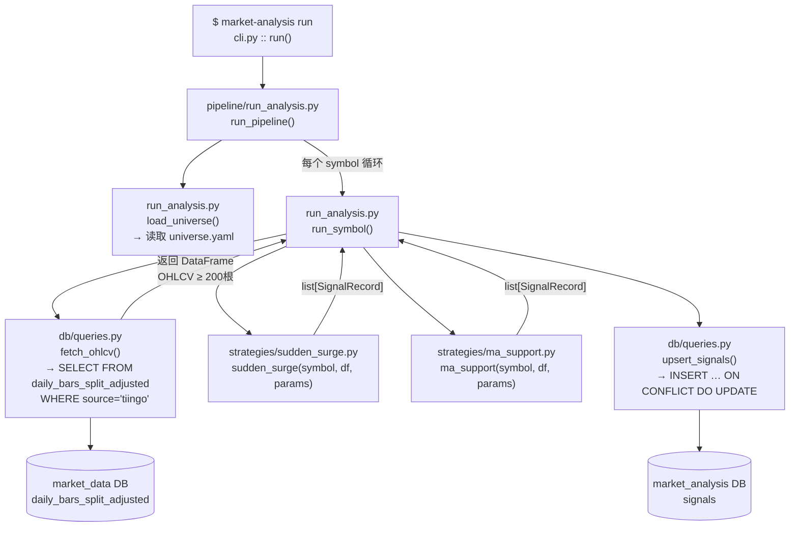
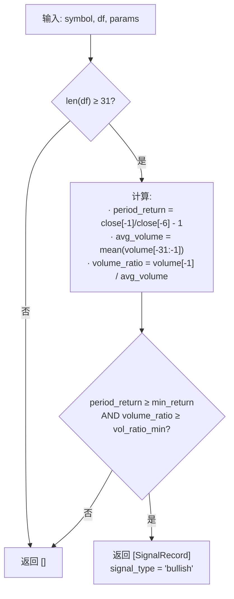
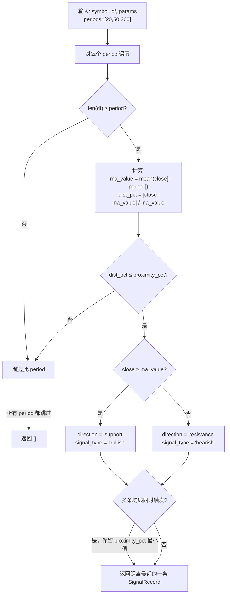
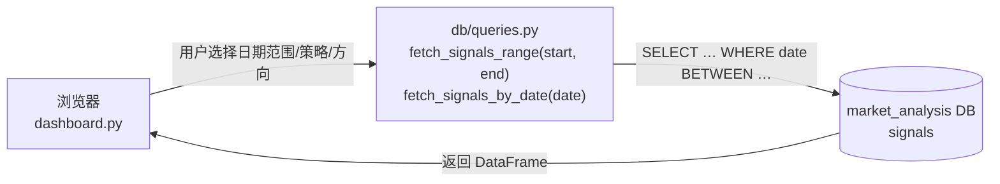
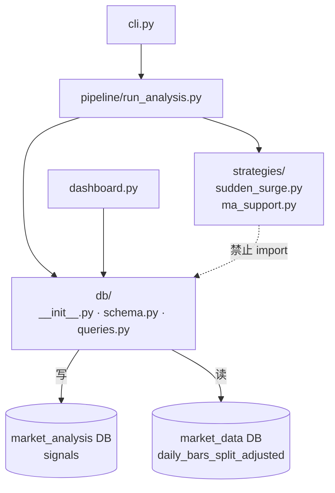

# Market Analysis — 行情信号分析系统

基于 Python 的量化信号生成系统。每日自动读取股票行情数据，运行多策略分析，将触发的交易信号持久化存储，并通过 Streamlit Dashboard 可视化展示。

---

## 项目定位

| 维度 | 说明 |
|------|------|
| 核心职责 | 信号生成：识别符合策略条件的交易机会 |
| 不做的事 | 策略回测、持仓管理、自动下单 |
| 数据来源 | 直连 PostgreSQL，读取 `market_data` 库的分复权日线数据 |
| 指标计算 | 实时从 OHLCV 计算，不持久化存储 |
| 信号存储 | 记录每次触发事件到 `signals` 表，保留完整历史 |

---

## 技术架构

```
market_analysis/
├── dashboard.py                  # Streamlit 可视化入口
├── config/
│   ├── settings.yaml             # 策略参数配置
│   └── universe.yaml             # 监控股票池
├── src/market_analysis/
│   ├── config.py                 # 配置入口（pydantic-settings）
│   ├── db/
│   │   ├── __init__.py           # 双连接池（signals DB + OHLCV DB）
│   │   ├── schema.py             # 建表（幂等）
│   │   └── queries.py            # 信号读写 / OHLCV 读取
│   ├── strategies/
│   │   ├── __init__.py           # 策略注册表 STRATEGIES
│   │   ├── sudden_surge.py       # 策略：近期暴涨
│   │   └── ma_support.py         # 策略：均线支撑压力
│   ├── pipeline/
│   │   └── run_analysis.py       # 每日批量执行入口
│   └── cli.py                    # Typer CLI
└── tests/
    ├── conftest.py               # 合成 OHLCV 数据工厂
    └── test_strategies.py        # 策略单元测试
```

### 技术选型

| 用途 | 选择 | 说明 |
|------|------|------|
| 数据处理 | pandas | DataFrame 为核心数据载体 |
| 数据库连接 | psycopg 3 + psycopg-pool | 原生 PostgreSQL 驱动，连接池复用 |
| 配置管理 | pydantic-settings + YAML + .env | 分层配置：YAML 管策略参数，.env 管密钥 |
| CLI | Typer | 命令行工具入口 |
| 日志 | structlog | 结构化日志，便于排查 |
| Dashboard | Streamlit | 快速构建可视化界面 |
| 测试 | pytest | 策略逻辑单元测试 |
| Lint | ruff | 代码规范检查 |

---

## 数据库设计

### 双库架构

系统连接同一个 PostgreSQL 实例（Docker 容器 `n8n-postgres`）中的两个数据库：

```
PostgreSQL (localhost:5432)
├── market_data      ← 只读，读取 daily_bars_split_adjusted（OHLCV）
└── market_analysis  ← 读写，存储 signals（信号事件）
```

两个连接池在运行时同时维持，互不干扰。

### signals 表结构

```sql
CREATE TABLE signals (
    signal_id    TEXT        PRIMARY KEY,          -- SHA1(symbol|date|strategy) 前16位
    symbol       TEXT        NOT NULL,
    date         DATE        NOT NULL,             -- 信号触发的交易日
    strategy     TEXT        NOT NULL,             -- 策略名称
    signal_type  TEXT        NOT NULL,             -- 'bullish' | 'bearish'
    detail_json  JSONB,                            -- 策略专属细节（见下文）
    created_at   TIMESTAMPTZ NOT NULL DEFAULT now(),
    UNIQUE (symbol, date, strategy)                -- 每 symbol/日期/策略最多一条
);
```

**detail_json 示例：**

```json
// sudden_surge
{"return_5d": 0.12, "volume_ratio": 2.3, "trigger_day_return": 0.08}

// ma_support
{"ma_period": 50, "ma_value": 182.5, "close": 184.2, "proximity_pct": 0.009, "direction": "support"}
```

---

## 策略说明

策略是**纯函数**：输入 `(symbol, df, params)` → 输出 `list[SignalRecord]`。新增策略只需新建文件 + 注册一行。

### 1. 近期暴涨（sudden_surge）

**触发条件**（同时满足）：
- 最近 N 个交易日（默认 5 日）涨幅 ≥ 阈值（默认 8%）
- 触发日成交量 ≥ 近 30 日均量的 1.5 倍

**信号类型**：bullish（上涨动能确认）

**detail 字段**：
| 字段 | 含义 |
|------|------|
| `return_5d` | 观察窗口内总涨幅 |
| `volume_ratio` | 当日量/均量比 |
| `trigger_day_return` | 触发当日涨幅 |

---

### 2. 均线支撑压力（ma_support）

**触发条件**：收盘价距某均线（20/50/200 日）的偏差 ≤ 2%

**信号类型**：
- 价格在均线**上方**接近 → `support`（支撑）→ bullish
- 价格在均线**下方**接近 → `resistance`（压力）→ bearish

**多周期冲突处理**：若同日多条均线同时触发，只保留距离最近的一条。

**detail 字段**：
| 字段 | 含义 |
|------|------|
| `ma_period` | 均线周期 |
| `ma_value` | 均线值 |
| `close` | 收盘价 |
| `proximity_pct` | 价格偏离均线的百分比 |
| `direction` | support / resistance |

---

## 执行流程

### 每日调度顺序



### CLI → Pipeline 调用链



### 策略内部判断逻辑

#### sudden_surge（近期暴涨）



#### ma_support（均线支撑压力）



### Dashboard 查询路径



---

## 快速开始

### 1. 环境准备

```bash
# 创建虚拟环境
python -m venv .venv
.venv/Scripts/activate          # Windows
# source .venv/bin/activate     # macOS/Linux

# 安装依赖（清华镜像）
pip install -i https://pypi.tuna.tsinghua.edu.cn/simple -e .
```

### 2. 配置数据库连接

复制并编辑 `.env`：

```bash
cp .env.example .env
```

```env
DB_HOST=localhost
DB_PORT=5432
DB_NAME=market_analysis       # 信号写入库
DB_USER=market_data_user
DB_PASSWORD=your_password

SOURCE_DB_NAME=market_data    # OHLCV 读取库
```

### 3. 初始化数据库

```bash
market-analysis init-db
```

### 4. 配置股票池

编辑 `config/universe.yaml`，添加需要监控的股票代码：

```yaml
symbols:
  - AAPL
  - MSFT
  - NVDA
  # ...
```

### 5. 运行信号分析

```bash
market-analysis run --universe config/universe.yaml
```

### 6. 查看信号

```bash
# 查看今日信号
market-analysis show

# 查看指定日期
market-analysis show --date 2026-05-21

# 过滤策略
market-analysis show --strategy sudden_surge
```

### 7. 启动 Dashboard

```bash
streamlit run dashboard.py --server.port 8504
```

---

## 策略参数调整

编辑 `config/settings.yaml`：

```yaml
strategies:
  sudden_surge:
    lookback_days: 5       # 观察窗口（交易日数）
    min_return: 0.08       # 最小涨幅阈值（8%）
    volume_ratio_min: 1.5  # 最小量比

  ma_support:
    periods: [20, 50, 200] # 均线周期列表
    proximity_pct: 0.02    # 距均线最大偏差（2%）
    directions:
      - support
      - resistance
```

> 注意：调整参数后历史信号不会重算，如需重跑历史请手动清空对应日期的信号记录。

---

## 新增策略

1. 在 `src/market_analysis/strategies/` 新建文件，实现函数：

```python
def my_strategy(symbol: str, df: pd.DataFrame, params: dict) -> list[dict]:
    # df: DatetimeIndex，列为 open/high/low/close/volume
    # 返回空列表表示无信号
    ...
```

2. 在 `strategies/__init__.py` 注册：

```python
from market_analysis.strategies.my_strategy import my_strategy

STRATEGIES = {
    "sudden_surge": sudden_surge,
    "ma_support":   ma_support,
    "my_strategy":  my_strategy,   # 新增
}
```

3. 在 `settings.yaml` 添加参数块，运行测试：

```bash
pytest tests/
```

---

## 模块依赖关系


