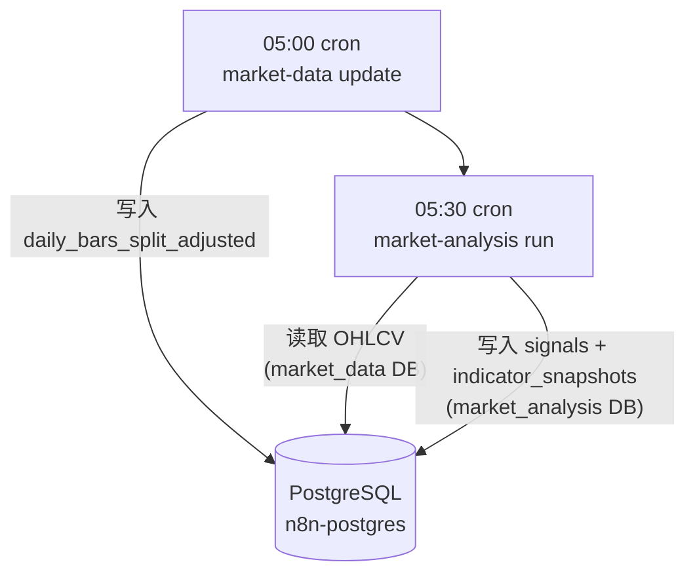
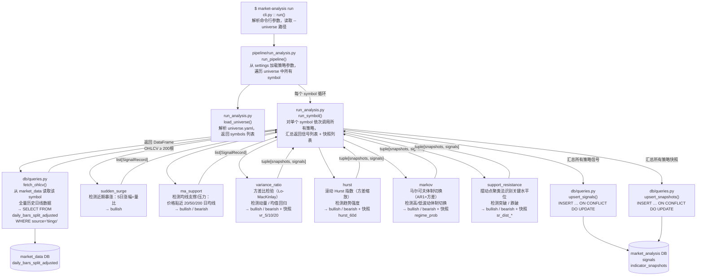
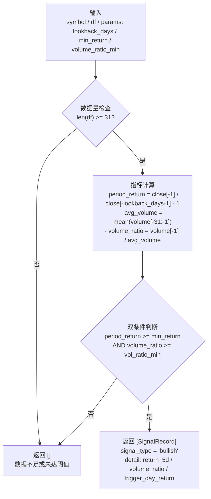
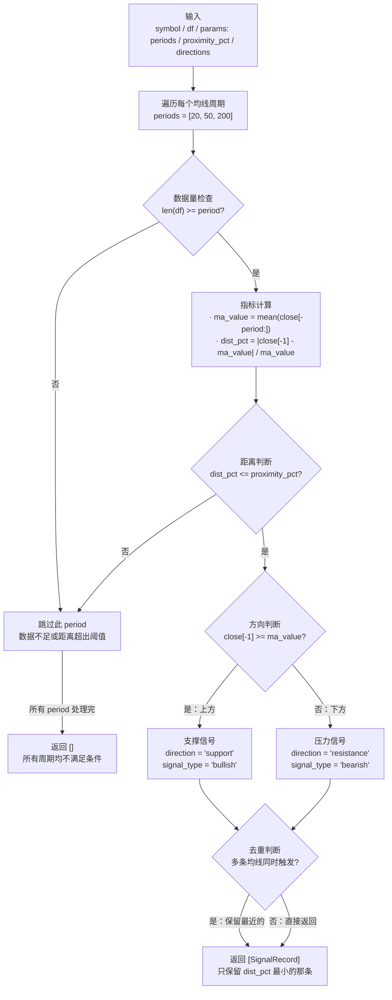
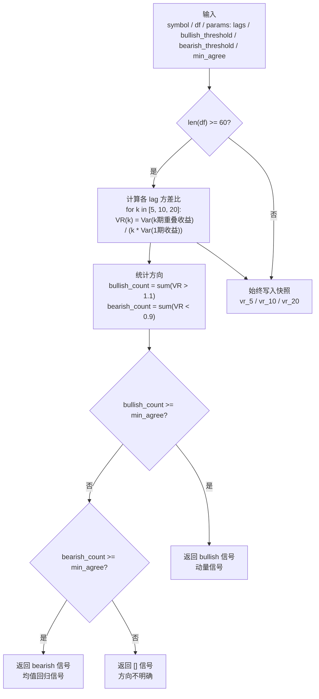
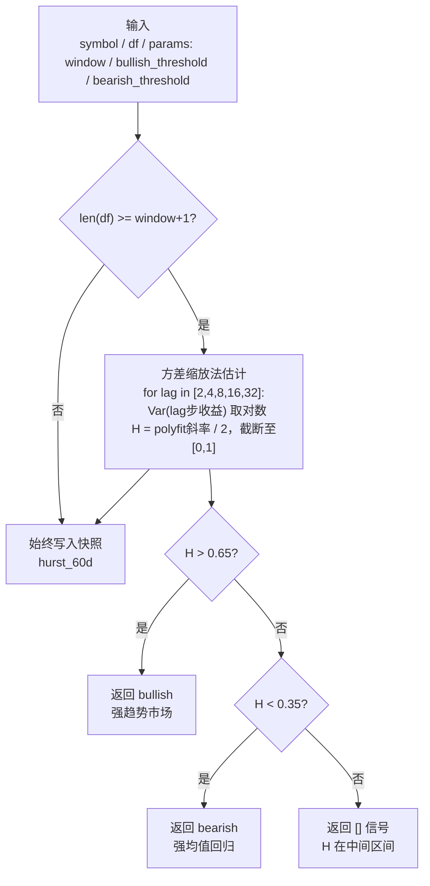
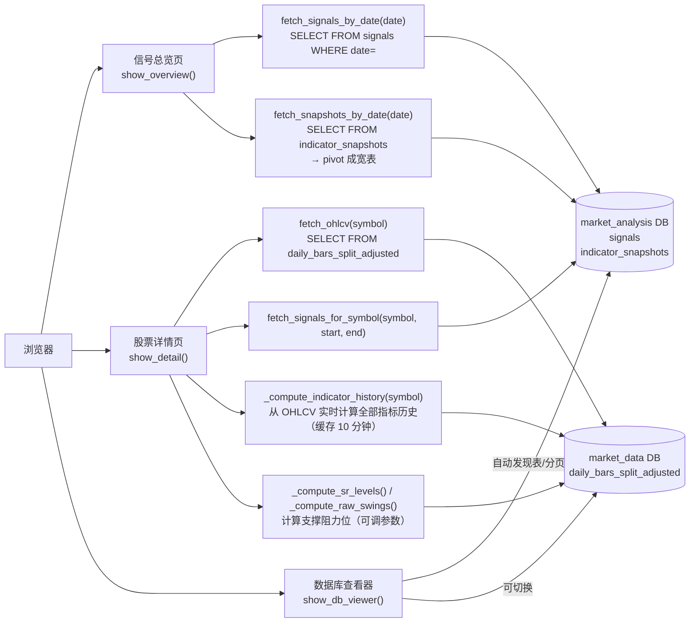
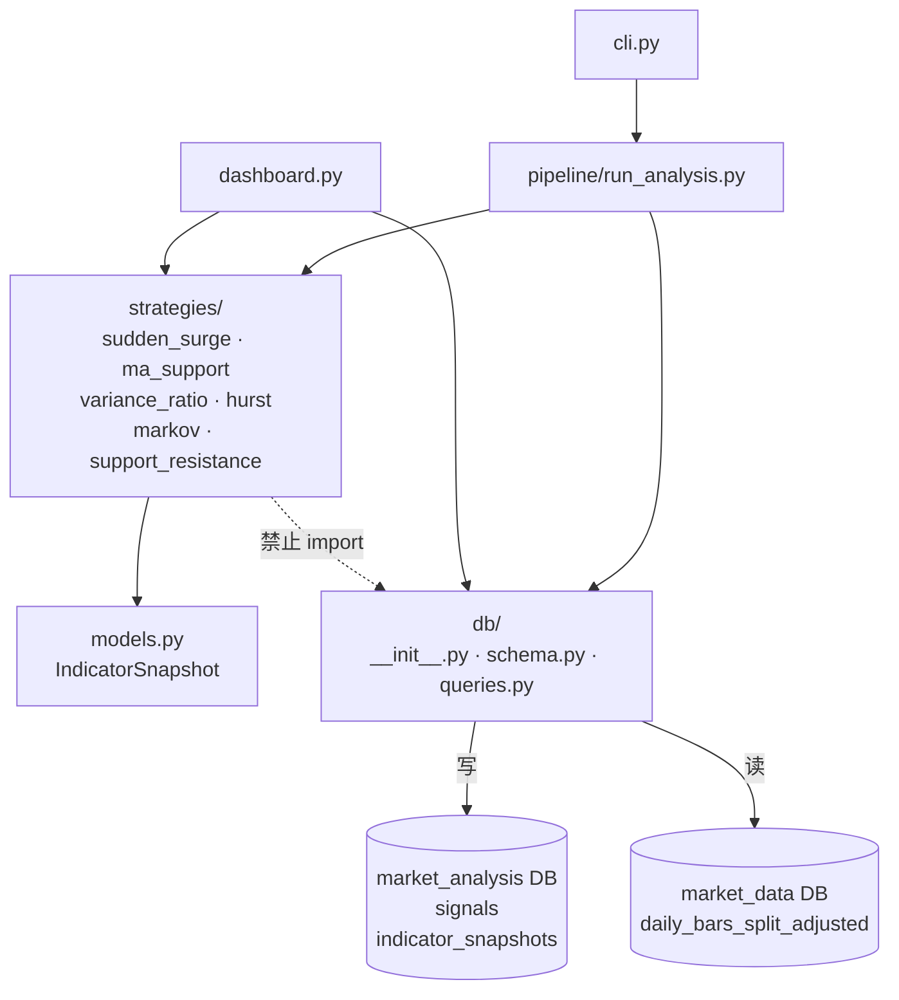

# Market Analysis — 行情信号分析系统

基于 Python 的量化信号生成系统。每日自动读取股票行情数据，运行多策略分析，将触发的交易信号和指标快照持久化存储，并通过 Streamlit Dashboard 可视化展示。

---

## 目录

- [项目定位](#项目定位)
- [技术架构](#技术架构)
  - [技术选型](#技术选型)
- [数据库设计](#数据库设计)
  - [双库架构](#双库架构)
  - [signals 表结构](#signals-表结构)
  - [indicator_snapshots 表结构](#indicator_snapshots-表结构)
- [策略说明](#策略说明)
  - [1. 近期暴涨（sudden_surge）](#1-近期暴涨sudden_surge)
  - [2. 均线支撑压力（ma_support）](#2-均线支撑压力ma_support)
  - [3. 方差比检验（variance_ratio）](#3-方差比检验variance_ratio)
  - [4. Hurst 指数（hurst）](#4-hurst-指数hurst)
  - [5. 马尔可夫体制切换（markov）](#5-马尔可夫体制切换markov)
  - [6. 支撑阻力位（support_resistance）](#6-支撑阻力位support_resistance)
- [执行流程](#执行流程)
  - [每日调度顺序](#每日调度顺序)
  - [CLI → Pipeline 调用链](#cli--pipeline-调用链)
  - [策略内部判断逻辑](#策略内部判断逻辑)
  - [Dashboard 查询路径](#dashboard-查询路径)
- [快速开始](#快速开始)
- [策略参数调整](#策略参数调整)
- [新增策略](#新增策略)
- [模块依赖关系](#模块依赖关系)

---

## 项目定位

| 维度 | 说明 |
|------|------|
| 核心职责 | 信号生成：识别符合策略条件的交易机会 |
| 不做的事 | 策略回测、持仓管理、自动下单 |
| 数据来源 | 直连 PostgreSQL，读取 `market_data` 库的分复权日线数据 |
| 指标计算 | 实时从 OHLCV 计算，每日快照结果持久化到 `indicator_snapshots` |
| 信号存储 | 记录每次触发事件到 `signals` 表，保留完整历史 |

---

## 技术架构

```
market_analysis/
├── dashboard.py                  # Streamlit 可视化入口（3页）
├── config/
│   ├── settings.yaml             # 策略参数配置
│   └── universe.yaml             # 监控股票池
├── src/market_analysis/
│   ├── config.py                 # 配置入口（pydantic-settings）
│   ├── models.py                 # 数据模型（IndicatorSnapshot）
│   ├── db/
│   │   ├── __init__.py           # 双连接池（signals DB + OHLCV DB）
│   │   ├── schema.py             # 建表（signals + indicator_snapshots，幂等）
│   │   └── queries.py            # 信号/快照读写 / OHLCV 读取
│   ├── strategies/
│   │   ├── __init__.py           # 策略注册表 STRATEGIES
│   │   ├── sudden_surge.py       # 策略：近期暴涨
│   │   ├── ma_support.py         # 策略：均线支撑压力
│   │   ├── variance_ratio.py     # 策略：方差比检验（Lo-MacKinlay）
│   │   ├── hurst.py              # 策略：Hurst 指数（方差缩放法）
│   │   ├── markov.py             # 策略：马尔可夫体制切换
│   │   └── support_resistance.py # 策略：支撑阻力位（摆动点聚类）
│   ├── pipeline/
│   │   └── run_analysis.py       # 每日批量执行入口
│   └── cli.py                    # Typer CLI
└── tests/
    ├── conftest.py               # 合成 OHLCV 数据工厂
    └── test_strategies.py        # 策略单元测试
```

### 技术选型

| 用途 | 选择 | 说明 |
|------|------|------|
| 数据处理 | pandas | DataFrame 为核心数据载体 |
| 数据库连接 | psycopg 3 + psycopg-pool | 原生 PostgreSQL 驱动，连接池复用 |
| 配置管理 | pydantic-settings + YAML + .env | 分层配置：YAML 管策略参数，.env 管密钥 |
| CLI | Typer | 命令行工具入口 |
| 日志 | structlog | 结构化日志，便于排查 |
| Dashboard | Streamlit + Plotly | 交互式可视化界面 |
| 测试 | pytest | 策略逻辑单元测试 |
| Lint | ruff | 代码规范检查 |
| 统计模型 | statsmodels | Markov 体制切换模型 |
| 信号处理 | scipy | 摆动点检测（argrelextrema） |

---

## 数据库设计

### 双库架构

系统连接同一个 PostgreSQL 实例（Docker 容器 `n8n-postgres`）中的两个数据库：

```
PostgreSQL (localhost:5432)
├── market_data      ← 只读，读取 daily_bars_split_adjusted（OHLCV）
└── market_analysis  ← 读写，存储 signals（信号事件）+ indicator_snapshots（指标快照）
```

两个连接池在运行时同时维持，互不干扰。

### signals 表结构

```sql
CREATE TABLE signals (
    signal_id    TEXT        PRIMARY KEY,          -- SHA1(symbol|date|strategy) 前16位
    symbol       TEXT        NOT NULL,
    date         DATE        NOT NULL,             -- 信号触发的交易日
    strategy     TEXT        NOT NULL,             -- 策略名称
    signal_type  TEXT        NOT NULL,             -- 'bullish' | 'bearish'
    detail_json  JSONB,                            -- 策略专属细节（见下文）
    created_at   TIMESTAMPTZ NOT NULL DEFAULT now(),
    UNIQUE (symbol, date, strategy)                -- 每 symbol/日期/策略最多一条
);
```

**detail_json 示例：**

```json
// sudden_surge
{"return_5d": 0.12, "volume_ratio": 2.3, "trigger_day_return": 0.08}

// ma_support
{"ma_period": 50, "ma_value": 182.5, "close": 184.2, "proximity_pct": 0.009, "direction": "support"}

// variance_ratio
{"vr_5": 1.23, "vr_10": 1.15, "vr_20": 1.11, "direction": "momentum"}

// hurst
{"hurst": 0.68, "window": 60, "interpretation": "trending"}

// markov
{"regime_prob": 0.82, "prev_prob": 0.61, "event": "entered_high_vol"}

// support_resistance
{"level": 182.5, "zone": [181.2, 183.8], "touches": 4, "breakout": "above_resistance"}
```

### indicator_snapshots 表结构

存储每日各策略输出的量化指标值，供 Dashboard 历史走势图使用：

```sql
CREATE TABLE indicator_snapshots (
    symbol    TEXT  NOT NULL,
    date      DATE  NOT NULL,
    indicator TEXT  NOT NULL,
    value     FLOAT NOT NULL,
    PRIMARY KEY (symbol, date, indicator)
);
```

**各策略输出的指标：**

| 策略 | 指标名 | 含义 |
|------|--------|------|
| sudden_surge | `ss_ret5d` | 5日涨幅 |
| sudden_surge | `ss_vol_ratio` | 量比 |
| ma_support | `ma_dist_20` / `ma_dist_50` / `ma_dist_200` | 价格距各均线偏差 |
| variance_ratio | `vr_5` / `vr_10` / `vr_20` | 各滞后期方差比 |
| hurst | `hurst_60d` | 60日滚动 Hurst 指数 |
| markov | `markov_regime_prob` | 当前处于高波动体制的概率 |
| support_resistance | `sr_dist_support` | 价格距最近支撑位的距离 |
| support_resistance | `sr_dist_resistance` | 价格距最近阻力位的距离 |

---

## 策略说明

策略框架设计为**纯函数**，无副作用，便于独立测试。基础策略返回信号列表；进阶策略同时返回指标快照和信号：

```python
# 基础策略签名（sudden_surge / ma_support）
def strategy(symbol: str, df: pd.DataFrame, params: dict) -> list[SignalRecord]:
    ...

# 进阶策略签名（variance_ratio / hurst / markov / support_resistance）
def strategy(
    symbol: str,
    df: pd.DataFrame,
    params: dict,
) -> tuple[list[IndicatorSnapshot], list[dict[str, Any]]]:
    ...
```

新增策略只需新建文件 + 在注册表加一行 + 在 settings.yaml 加参数块。

---

### 1. 近期暴涨（sudden_surge）

**触发条件**（同时满足）：
- 最近 N 个交易日（默认 5 日）涨幅 ≥ 阈值（默认 8%）
- 触发日成交量 ≥ 近 30 日均量的 1.5 倍

**信号类型**：bullish（上涨动能确认）

**detail 字段**：
| 字段 | 含义 |
|------|------|
| `return_5d` | 观察窗口内总涨幅 |
| `volume_ratio` | 当日量/均量比 |
| `trigger_day_return` | 触发当日涨幅 |

---

### 2. 均线支撑压力（ma_support）

**触发条件**：收盘价距某均线（20/50/200 日）的偏差 ≤ 2%

**信号类型**：
- 价格在均线**上方**接近 → `support`（支撑）→ bullish
- 价格在均线**下方**接近 → `resistance`（压力）→ bearish

**多周期冲突处理**：若同日多条均线同时触发，只保留距离最近的一条。

**detail 字段**：
| 字段 | 含义 |
|------|------|
| `ma_period` | 均线周期 |
| `ma_value` | 均线值 |
| `close` | 收盘价 |
| `proximity_pct` | 价格偏离均线的百分比 |
| `direction` | support / resistance |

---

### 3. 方差比检验（variance_ratio）

基于 Lo-MacKinlay（1988）方差比检验，判断价格序列的自相关方向。

**原理**：
- `VR(k) = 1`：随机游走（无自相关）
- `VR(k) > 1`：正自相关（动量，价格趋势延续）
- `VR(k) < 1`：负自相关（均值回归，涨后跌）

**触发条件**：lag = 5、10、20 三个周期中，至少 `min_agree`（默认 2）个同方向超阈值

**信号类型**：
- 至少 2 个 VR > 1.1 → bullish（动量信号）
- 至少 2 个 VR < 0.9 → bearish（均值回归信号）

**快照指标**：`vr_5`、`vr_10`、`vr_20`（每日均计算，不论是否触发信号）

**detail 字段**：
| 字段 | 含义 |
|------|------|
| `vr_5` / `vr_10` / `vr_20` | 各滞后期方差比值 |
| `direction` | momentum / mean_reversion |

---

### 4. Hurst 指数（hurst）

滚动 Hurst 指数，通过方差缩放法（variance scaling）估计价格序列的分形特征。

**原理**：
- `H = 0.5`：随机游走
- `H > 0.5`：正自相关，趋势性（动量市场）
- `H < 0.5`：负自相关，均值回归性

**估计方法**：`Var(k步收益) ∝ k^(2H)`，对多个滞后期（2, 4, 8, 16, 32）取对数线性回归斜率的一半。

**触发条件**：
- `H > 0.65` → bullish（强趋势信号）
- `H < 0.35` → bearish（强均值回归信号）

**快照指标**：`hurst_60d`（60日滚动窗口，每日计算）

**detail 字段**：
| 字段 | 含义 |
|------|------|
| `hurst` | 当日 Hurst 指数值 |
| `window` | 计算窗口（交易日） |
| `interpretation` | trending / mean_reverting |

---

### 5. 马尔可夫体制切换（markov）

双体制马尔可夫自回归模型（Markov-Switching AR(1)，方差切换），识别市场所处的波动体制。

**原理**：用过去 252 个交易日的对数收益率拟合含 2 个体制的 AR(1) 模型（高/低波动体制各一套方差参数），通过过滤概率（filtered probabilities）判断当前体制。

**触发条件**（体制切换时触发）：
- 前日概率 ≤ 阈值，当日高波动概率 > 0.75 → bearish（进入高波动/风险体制）
- 前日概率 ≥ 1-阈值，当日概率 < 0.25 → bullish（进入低波动体制）

**快照指标**：`markov_regime_prob`（当前处于高波动体制的过滤概率，0~1）

**detail 字段**：
| 字段 | 含义 |
|------|------|
| `regime_prob` | 当日高波动体制概率 |
| `prev_prob` | 前日高波动体制概率 |
| `event` | entered_high_vol / entered_low_vol |

> 注意：此策略依赖 `statsmodels`，拟合耗时较长，适合每日离线批量运行。

---

### 6. 支撑阻力位（support_resistance）

摆动点聚类法识别关键价格水平，检测价格突破行为。

**算法流程**：
1. `scipy.argrelextrema` 检测历史 K 线中的摆动高点（high 极大）和低点（low 极小）
2. 对所有摆动价格排序后做单次扫描聚类：相邻价格差 ≤ `cluster_pct`（默认 1.5%）归为同一水平区
3. 过滤：触及次数 ≥ `min_touches`（默认 2）且时间跨度 ≥ `min_span_days`（默认 10 天）
4. 突破检测：收盘穿越阻力区上边界 → bullish；跌穿支撑区下边界 → bearish

**信号类型**：
- 收盘突破阻力区上边界 → bullish
- 收盘跌破支撑区下边界 → bearish

**快照指标**：
- `sr_dist_support`：(收盘 - 最近支撑位中心) / 收盘，值越小越接近支撑
- `sr_dist_resistance`：(最近阻力位中心 - 收盘) / 收盘，值越小越接近阻力

**detail 字段**：
| 字段 | 含义 |
|------|------|
| `level` | 水平区中心价格 |
| `zone` | [zone_low, zone_high] 区间边界 |
| `touches` | 该水平区历史触及次数 |
| `breakout` | above_resistance / below_support |

---

## 执行流程

### 每日调度顺序



### CLI → Pipeline 调用链



### 策略内部判断逻辑

#### sudden_surge（近期暴涨）



#### ma_support（均线支撑压力）



#### variance_ratio（方差比检验）



#### hurst（Hurst 指数）



### Dashboard 查询路径



---

## 快速开始

### 1. 环境准备

```bash
# 创建虚拟环境
python -m venv .venv
.venv/Scripts/activate          # Windows
# source .venv/bin/activate     # macOS/Linux

# 安装依赖（清华镜像）
pip install -i https://pypi.tuna.tsinghua.edu.cn/simple -e .
```

### 2. 配置数据库连接

复制并编辑 `.env`：

```bash
cp .env.example .env
```

```env
DB_HOST=localhost
DB_PORT=5432
DB_NAME=market_analysis       # 信号写入库
DB_USER=market_data_user
DB_PASSWORD=your_password

SOURCE_DB_NAME=market_data    # OHLCV 读取库
```

### 3. 初始化数据库

```powershell
# 激活虚拟环境（VS Code Terminal / PowerShell）
.\.venv\Scripts\Activate.ps1

market-analysis init-db
```

### 4. 配置股票池

编辑 `config/universe.yaml`，添加需要监控的股票代码：

```yaml
symbols:
  - AAPL
  - MSFT
  - NVDA
  # ...
```

### 5. 运行信号分析

```powershell
# 激活虚拟环境（VS Code Terminal / PowerShell）
.\.venv\Scripts\Activate.ps1

market-analysis run --universe config/universe.yaml
```

### 6. 查看信号

```powershell
# 激活虚拟环境（VS Code Terminal / PowerShell）
.\.venv\Scripts\Activate.ps1

# 查看今日信号
market-analysis show

# 查看指定日期
market-analysis show --date 2026-05-21

# 过滤策略
market-analysis show --strategy sudden_surge
```

### 7. 启动 Dashboard

**推荐方式（后台运行，带 PID 管理）：**

```powershell
.\scripts\start_dashboard.ps1   # 启动
.\scripts\stop_dashboard.ps1    # 停止
```

脚本会在后台静默启动、自动检测重复运行、将 PID 写入 `logs/dashboard.pid`、日志写入 `logs/dashboard.log`。

> 首次运行若提示执行策略限制，先执行：
> `Set-ExecutionPolicy -Scope CurrentUser RemoteSigned`

启动后访问：`http://localhost:8504`

**或直接命令行前台运行：**

```powershell
# 激活虚拟环境（VS Code Terminal / PowerShell）
.\.venv\Scripts\Activate.ps1

streamlit run dashboard.py --server.port 8504
```

---

## Dashboard 功能说明

Dashboard 共三个页面，通过左侧导航栏切换：

### 信号总览页

- 顶部 4 个指标卡：扫描股票数、今日信号数、看涨/看跌数量
- 指标快照宽表：每行一个股票，列为各指标值 + 今日信号汇总
- **点击任意行**进入该股票的详情页
- 按策略/方向的信号分布柱状图

### 股票详情页

- **Plotly 交互式 K 线图**（涨绿跌红，支持缩放/平移/悬浮提示）
- **支撑阻力位可视化**：
  - 彩色阴影区显示每个水平区的价格范围（蓝色=支撑，红色=阻力，黄色=两用）
  - 虚线标注中心价格，标签显示价格和触及次数
  - 钻石标记已采用的摆动点，灰色圆点显示未采用的摆动点
- **多指标子图**（可独立开关）：
  - 技术指标面板：均线距离、SR 距离等价格类百分比指标
  - 量比面板：成交量放大倍数（量比=1 参考线）
  - 统计指标面板：Hurst、方差比、Markov 体制概率（H=0.5 和 VR=1.0 参考线）
- 信号标记叠加在 K 线图上（上三角=看涨，下三角=看跌）
- 最新指标值汇总表 + 历史信号记录表
- 左侧侧边栏可调支撑阻力位参数（实时重算，缓存 10 分钟）

### 数据库查看器

- 在 `market_analysis` / `market_data` 两个数据库之间切换
- 自动发现所有表，显示行数和字段列表
- 分页浏览表数据（每页 20~500 行可选）

---

## 策略参数调整

编辑 `config/settings.yaml`：

```yaml
strategies:
  sudden_surge:
    lookback_days: 5       # 观察窗口（交易日数）
    min_return: 0.08       # 最小涨幅阈值（8%）
    volume_ratio_min: 1.5  # 最小量比

  ma_support:
    periods: [20, 50, 200] # 均线周期列表
    proximity_pct: 0.02    # 距均线最大偏差（2%）
    directions:
      - support
      - resistance

  variance_ratio:
    lags: [5, 10, 20]         # 检验的滞后期
    bullish_threshold: 1.1    # VR 超过此值 → 动量信号
    bearish_threshold: 0.9    # VR 低于此值 → 均值回归信号
    min_agree: 2              # 至少多少个 lag 同向才触发

  hurst:
    window: 60                # 滚动窗口（交易日）
    bullish_threshold: 0.65   # H > 此值视为强趋势
    bearish_threshold: 0.35   # H < 此值视为强均值回归

  markov:
    fit_window: 252           # 用于拟合的历史天数
    regime_threshold: 0.75    # 体制概率超过此值视为切换
    order: 1                  # AR 阶数

  support_resistance:
    swing_order: 3            # 摆动点左右各需 N 根 K 线配合
    cluster_pct: 1.5          # 价格差 <= 1.5% 归为同一水平区
    min_touches: 2            # 最少触及次数
    min_span_days: 10         # 触及时间跨度至少 10 天
    max_levels: 5             # 最多输出几条关键位
    lookback_window: 500      # 用于检测的历史K线根数（500根≈2年）
```

> 注意：调整参数后历史信号不会重算，如需重跑历史请手动清空对应日期的信号记录。

---

## 新增策略

1. 在 `src/market_analysis/strategies/` 新建文件，实现函数：

```python
# 如需同时输出指标快照（推荐），使用进阶签名
from market_analysis.models import IndicatorSnapshot

def my_strategy(
    symbol: str,
    df: pd.DataFrame,
    params: dict,
) -> tuple[list[IndicatorSnapshot], list[dict]]:
    # df: DatetimeIndex，列为 open/high/low/close/volume
    # 返回 (快照列表, 信号列表)，无信号时返回空列表
    ...
```

2. 在 `strategies/__init__.py` 注册：

```python
from market_analysis.strategies.my_strategy import my_strategy

STRATEGIES = {
    "sudden_surge":       sudden_surge,
    "ma_support":         ma_support,
    "variance_ratio":     variance_ratio,
    "hurst":              hurst,
    "markov":             markov,
    "support_resistance": support_resistance,
    "my_strategy":        my_strategy,   # 新增
}
```

3. 在 `settings.yaml` 添加参数块，运行测试：

```bash
pytest tests/
```

---

## 模块依赖关系


